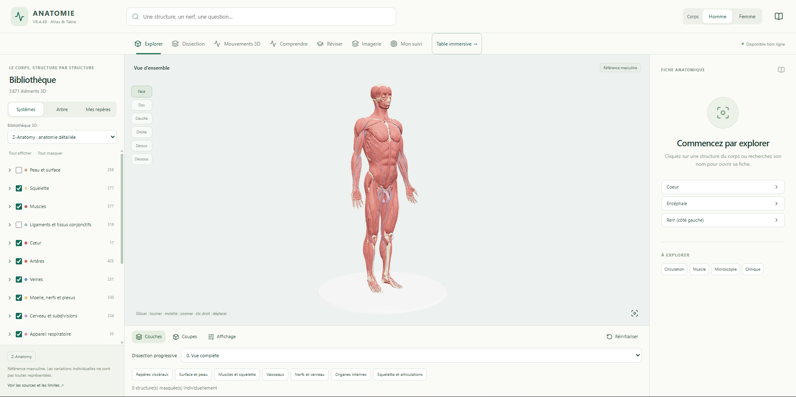
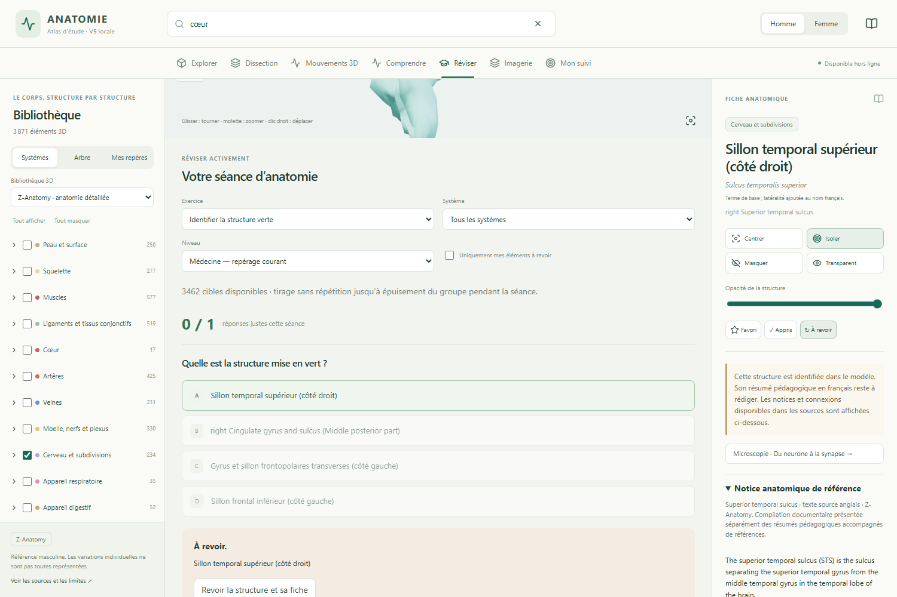
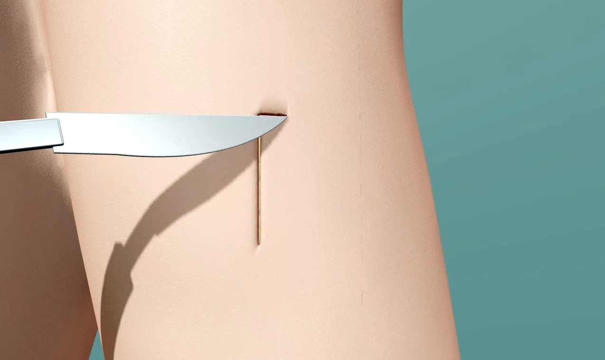
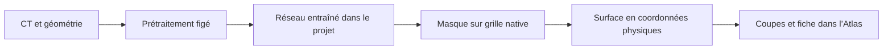
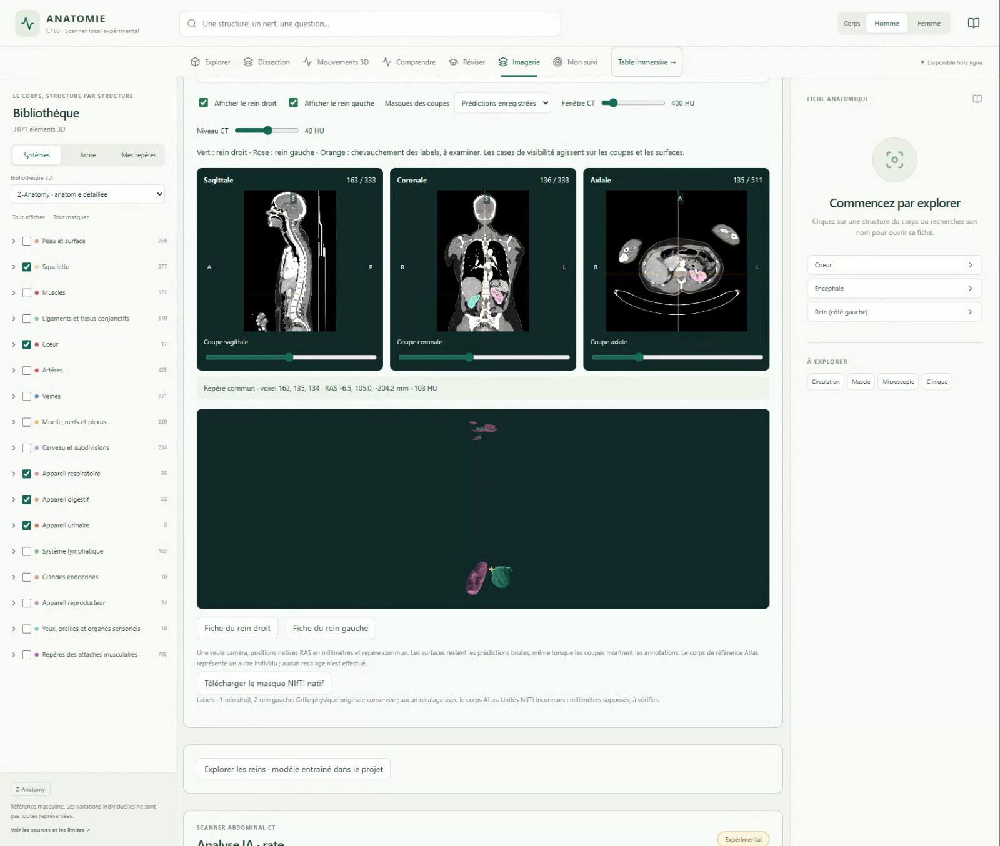

# Atlas Anatomie — explorer, comprendre, apprendre

**Projet en cours de développement · application pédagogique et recherche expérimentale.**

👉 **[Ouvrir la vitrine : captures, démonstrations et travail IA](https://BBBsouheil.github.io/atlas-anatomie-resultats/)**

Ce dépôt public présente le travail réalisé. Le code de l’application et des expériences est sauvegardé dans un dépôt privé distinct. La vitrine présente des preuves conservées ; elle n’exécute ni l’application ni les modèles.

*Capture V6.4.48 choisie par l’auteur : muscles et squelette, bibliothèque Z-Anatomy. Cette image ne valide pas le réalisme de la table.*

## Ce que fait l’application

L’Atlas est un environnement local pour explorer le corps en 3D et réviser l’anatomie. Le module IA en est une composante, avec d’autres outils :

| Usage | Fonctions implémentées | Limites actuelles |
| --- | --- | --- |
| Explorer | Rotation, zoom, recherche, arbre anatomique, sélection 3D | Disponibilité selon les structures sources |
| Observer les couches | Masquage, isolation, transparence, plans de coupe | Une coupe de vue n’est pas une incision |
| Étudier | Noms, repères, relations et fiches avec références | Documentation inégale, pas de complétude revendiquée |
| Comprendre | Modules neurone, synapse, néphron, filtration, œil, oreille, péristaltisme | Représentations pédagogiques simplifiées |
| Voir des mouvements | Animations articulaires, respiration, trajets nerveux | Illustrations non validées biomécaniquement, rendu à améliorer |
| Réviser | Identification, repérage 3D, QCM, correction, filtres, favoris et suivi | Qualité et couverture à vérifier |
| Manipuler les tissus | Table, scalpel, sonde, pince, écarteurs, ciseaux, annulation, reprise | C173 démontré sur le biceps gauche ; réalisme non validé |
| Explorer l’imagerie | Coupes synchronisées, fenêtre, surfaces et fiches | Recherche et pédagogie, pas diagnostic |

Les fonctions sont étayées par les sources d’interface et des preuves historiques conservées. Aucun nouvel audit complet d’usage n’a été réalisé pour cette publication.

*Retrouver une structure sur le corps, puis consulter la correction et sa fiche.*

## QCM local : le point de départ

Le projet est parti d’un outil de révision destiné à une étudiante en médecine à Angers. QCM local prépare des questions avec Ollama sur la machine, à partir de documents que l’utilisateur est autorisé à utiliser. Un bouton ouvre l’Atlas comme module distinct.

- Import de supports textuels ou PDF exploitables, choix du chapitre et des sous-parties.
- Nombre, difficulté et type de réponse réglables ; photos optionnelles à vérifier.
- Historique pour varier les passages et écarter des questions répétées.
- Correction, passage cité, lignes et pages lorsque l’import conserve ces informations.
- Bilan des réponses et des points repérés par sous-partie.

Le repérage automatique ne garantit pas une couverture exhaustive du cours. Les questions et photos demandent une vérification. La vitesse varie selon le matériel et le modèle. Cette branche d’origine n’est pas incluse dans le snapshot Atlas actuellement sauvegardé sur GitHub.

## Dissection : fonctionnelle, pas encore réaliste

**La vidéo de présentation de 89 secondes est retirée de la vitrine principale après revue visuelle.** Les changements de caméra, le contact apparent de la sonde et l’empilement des couches ne donnent pas une présentation acceptable. De nouvelles prises au cadrage fixe, avec contrôle des surfaces visibles et tractions séparées, n’ont pas permis un parcours complet et propre. Aucune amélioration de réalisme n’est revendiquée.

La [vitrine](https://BBBsouheil.github.io/atlas-anatomie-resultats/#dissection) affiche un [extrait court de 17 secondes sans repères](media/dissection-c173.webm) : scalpel, traction, relâchement et maintien de la peau. Les mouvements sont enregistrés à vitesse normale ; les préparations intermédiaires sont coupées. Cet extrait ne remplace pas la preuve du parcours complet. Le [test historique de 3 min 55](media/dissection-c173-diagnostic-original.webm) reste une preuve fonctionnelle distincte, avec ses diagnostics. Les enregistrements et tentatives sont conservés.

C173 part des tissus recouvrants, expose le biceps gauche et incise une petite zone. Annulation, rétablissement et sauvegarde/reprise sont consignés. Ce scénario reste la référence fonctionnelle de développement.

Le réalisme des tissus, de la traction et de l’intérieur reconstruit n’est pas validé. Le test historique C173 rapportait environ 27,7 FPS et une pause de 583 ms ; ces mesures ne concernent pas la nouvelle capture de 89 secondes. La réussite sur le bras ne démontre pas une dissection libre de tout le corps. **Le chantier du sang reste suspendu.**

## IA : des entraînements réalisés dans le projet

Les maillages de référence de l’Atlas sont adaptés de ressources anatomiques tierces et crédités. Ils ne sont pas générés par les réseaux entraînés ici.

Le point de départ est un scanner CT enregistré au format NIfTI : un volume constitué de nombreuses coupes 2D, avec leur taille et leur position dans l’espace. Un voxel est un petit élément de ce volume, l’équivalent d’un pixel en 3D.

Pour l’apprentissage, les CT publics sont accompagnés d’annotations indiquant où se trouvent les organes. Les réseaux partent de poids aléatoires et ajustent leurs paramètres en comparant leurs prédictions à ces annotations. Les expériences de rate et de reins utilisent des modèles distincts : l’un cherche la rate, l’autre les reins droit et gauche.

Après entraînement, les prédictions sont converties en masques binaires : pour chaque voxel, le masque indique s’il est attribué à l’organe ou non. Le masque est remis sur la grille du scanner d’origine, puis sa frontière sert à reconstruire une surface 3D. Les couleurs affichées sur les coupes montrent les prédictions, pas les annotations de référence. Les surfaces conservent les coordonnées de l’examen ; elles ne sont pas automatiquement alignées sur le corps de référence de l’Atlas.

**[Démonstration C183, environ 12 secondes](media/scanner-c183.webm)** : examen **public TotalSegmentator**, déjà examiné dans C182. Elle montre l’intégration et les fragments de prédiction conservés ; ce n’est pas un nouveau test externe ni une validation clinique. Aucun CT brut n’est distribué ici.

La [vitrine agrandie](https://BBBsouheil.github.io/atlas-anatomie-resultats/#ia) permet maintenant de choisir les trois coupes, la sagittale, la coronale, l’axiale ou les surfaces 3D. Ces vues sont des recadrages de 9,4 secondes du même enregistrement, sans modification des coupes ou prédictions. Des captures des coupes et de la fiche complètent la vidéo.

### Rate : progrès de validation et limite externe

C176 compare deux U-Net 2D avec ou sans augmentations ; C177 ajoute trois coupes voisines. Split MSD : **27 cas d’apprentissage / 7 validation / 7 test interne**. C177 est sélectionné sur la validation déjà consultée, sans nouveau test interne utilisé pour régler ce candidat.

| Cohorte et métrique | C176 2D retenu | C177 2,5D |
| --- | ---: | ---: |
| Validation native connue, 7 cas — Dice moyen | 0,951 | 0,958 |
| Validation native connue, 7 cas — HD95 moyen | 11,68 mm | 2,77 mm |
| Externe AMOS22, 29 paires — Dice moyen | 0,771 | 0,809 |
| Externe AMOS22, 29 paires — HD95 moyen | 24,99 mm | 37,41 mm |

Le Dice apparié s’améliore, mais le HD95 moyen se dégrade. Sur **30 CT sélectionnés**, une tentative C177 interrompue reste conservée sans remplacement : 29 paires, une paire manquante. Pire Dice C177 : 0,105 ; HD95 maximal : 307,78 mm. Les groupes observables ne certifient pas 30 identités indépendantes.

### Reins : conserver aussi les résultats négatifs

C181 entraîne un U-Net 2D avec deux sorties, sur 24 volumes AMOS d’apprentissage et 6 de validation. C182 évalue 29 CT admissibles d’une autre source ; la généralisation est insuffisante.

C184 entraîne un candidat 2,5D, puis C185 compare les modèles figés sur **30 nouveaux volumes CT**, sans certification de 30 patients indépendants. Les **60 prédictions aboutissent**, mais C184 se dégrade :

| C185 — critère primaire | C181 droit | C184 droit | C181 gauche | C184 gauche |
| --- | ---: | ---: | ---: | ---: |
| Dice moyen | 0,745 | 0,701 | 0,642 | 0,634 |
| HD95 moyen | 71,23 mm | 204,11 mm | 55,38 mm | 123,92 mm |

26 références non vides à droite, 27 à gauche ; les 4 références vides droites et 3 gauches restent séparées. Couvertures limitées ou inconnues conservées. **C184 n’est pas promu.** Une exécution réussie ne prouve pas une bonne segmentation.

Dice/IoU : recouvrement avec l’annotation, plus proche de 1 est préférable. HD95 : distance entre contours, plus faible est préférable.

👉 [Bilans détaillés C182/C184/C185](RESULTATS_IA_DETAILS.md) · [Agrégats numériques enregistrés](results-public.json)

## Le travail d’ingénierie

- Seeds, configurations, hyperparamètres, checkpoints, courbes et métriques conservés.
- Cohortes auditées et protocoles figés avant les prédictions externes ; exclusions et échecs documentés.
- Retour au volume natif, latéralité et coordonnées physiques contrôlés, parité d’exports vérifiée.
- CT partagé entre les deux reins, états de tâche, annulation et verrou de worker.
- Sauvegarde et réouverture d’un résultat sans nouvelle inférence.
- Dans C182, moyennes sur 29 cas : **1,44 s pour le réseau**, **40,40 s pour prédiction + export**, **48,17 s avec scoring de référence**, hors chargement initial du modèle.

Application : React, TypeScript, Three.js. Traitement : Python, PyTorch, NIfTI. QCM : Ollama local.

## État et périmètre

La version stable reste distincte des candidats. Les tests logiciels ne constituent pas une validation médicale. Réalisme, fluidité, complétude pédagogique et robustesse des segmentations restent des chantiers ouverts.

Le snapshot de code privé couvre **l’Atlas C183 et les sources rénales C181/C184/C185**. Il ne contient pas encore l’ensemble des sources QCM local et de toutes les campagnes de rate. Les archives originales restent conservées localement. Aucun modèle n’est modifié pour publier cette page.

## Sources et droits

Les notices MIT existantes du logiciel sont conservées. Les maillages, textes et données tierces gardent leurs propres conditions. Aucune nouvelle licence générale pour les contributions originales n’est choisie ici.

- [Attributions des captures et vidéos](MEDIA_ATTRIBUTIONS.md), [notice des données et droits](NOTICE_DONNEES_ET_DROITS.txt).
- [Z-Anatomy](https://github.com/Z-Anatomy/Models-of-human-anatomy), [BodyParts3D](https://dbarchive.biosciencedbc.jp/en/bodyparts3d/lic.html), [Human Atlas](https://github.com/slorksmo/Human-Atlas).
- [Medical Segmentation Decathlon](http://medicaldecathlon.com/), [AMOS](https://github.com/amoschallenge/amos22), [TotalSegmentator](https://zenodo.org/records/10047263).

Le dépôt public fournit une vitrine et des bilans, sans code scientifique, poids, CT bruts, annotations, imports privés ni bibliothèque de maillages.
