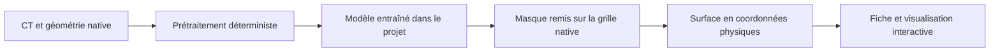
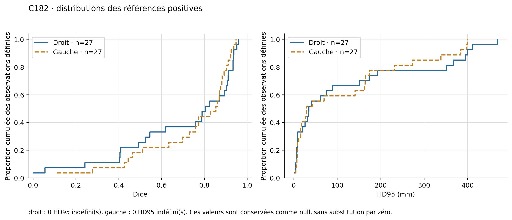
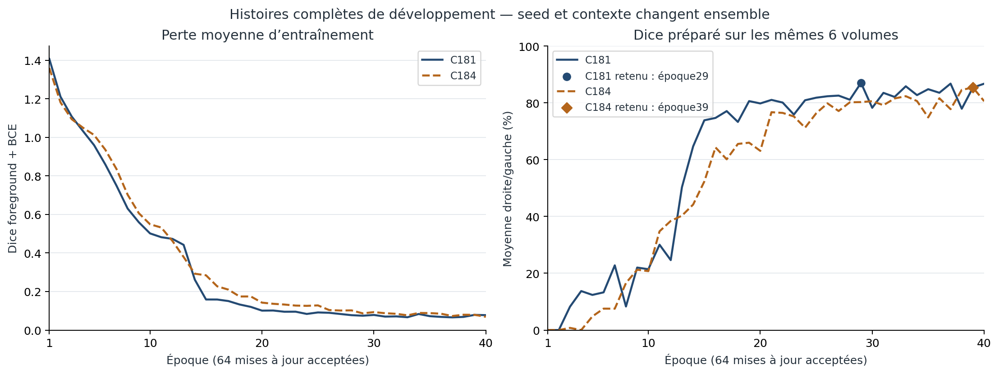

# Atlas 3D et segmentation CT — projet en cours

**Projet expérimental de recherche et de pédagogie.** Cette présentation publique montre une chaîne de traitement, des apprentissages réalisés et leurs limites. Le code est destiné à un dépôt privé. Les résultats ci-dessous proviennent des bilans conservés, sans nouvelle exécution scientifique pour cette présentation.

## Vue d’ensemble

Le projet associe un atlas anatomique 3D interactif à une chaîne de segmentation de scanners CT pour **deux organes : la rate et les reins droit/gauche**.

Les résultats patient conservent leur géométrie physique ; ils ne sont pas automatiquement alignés sur le corps de référence de l’atlas.

## Travail technique démontré

- **Interface 3D** : navigation anatomique, sélection de structures, fiches pédagogiques et vues de coupes, avec React et Three.js.
- **Apprentissage supervisé réel** : les modèles de rate et de reins ont été entraînés dans le projet à partir de CT annotés. Les expériences rénales C181/C184 partent d’une initialisation aléatoire ; leurs checkpoints et courbes d’apprentissage sont enregistrés.
- **Chaîne CT → masque → surface → fiche** : prétraitement, inférence, retour à la grille d’origine, export et visualisation. Les tests vérifient notamment les coordonnées et la parité des exports.
- **Traçabilité** : versions figées, empreintes SHA256, protocoles prospectifs, conservation des tentatives et séparation entre prédiction et scoring des annotations.
- **Analyse des erreurs** : bilans conservant les mauvais cas, références vides, couvertures limitées et limites d’indépendance des données.

L’exécution correcte du logiciel ne suffit pas à établir la qualité des segmentations.

## Résultats et limites

### Rate

Les modèles ont été entraînés sur Medical Segmentation Decathlon, tâche rate. Une évaluation externe sur des CT AMOS22 a été menée dans C179. Les identités indépendantes des patients ne sont pas certifiées ; les groupes observables ne doivent pas être présentés comme des identités garanties. Aucun score de compétition officiel ni performance clinique n’est revendiqué ici. Les sources originales sont citées plus bas.

### Reins — C182 : généralisation externe insuffisante

C182 évalue le modèle C181 figé sur **29 CT admissibles**, après une exclusion géométrique fixée avant l’inférence. Les 29 cas ont été scorés. Le critère primaire utilise **27 références non vides par côté** ; les références vides et couvertures limitées sont décrites séparément.

Dice et IoU mesurent le recouvrement avec la référence : plus ils sont proches de 1, mieux c’est. Le HD95 mesure une erreur de distance entre les contours : une valeur plus faible est préférable.

| Métrique primaire | Rein droit | Rein gauche |
| --- | ---: | ---: |
| Dice moyen | 0,692673 | 0,738662 |
| IoU moyen | 0,591062 | 0,626313 |
| HD95 moyen, mm | 124,954952 | 115,859915 |
| HD95 médian, mm | 34,500000 | 29,470324 |
| HD95 maximal, mm | 468,459629 | 399,264950 |

Valeurs arrondies pour la lecture ; les agrégats enregistrés sont reproduits dans [results-public.json](results-public.json). Le maximum droit atteint **46,85 cm**. Ces résultats sont faibles et ne permettent pas de présenter le modèle comme performant. Un fichier de référence vide ne démontre pas une absence clinique de rein. Aucun intervalle de confiance patient n’est estimé : les identités indépendantes ne sont pas certifiées.

*Figure originale déjà scellée : la longue queue des erreurs de distance reste visible.*

### Reins — C184 : régression de validation

Sur les **6 mêmes volumes / 12 côtés de validation de développement déjà consultés**, le Dice moyen passe de **0,866718 (C181)** à **0,851960 (C184)**. Huit côtés sur douze se dégradent. Le HD95 moyen passe de **16,526714 mm** à **31,044593 mm** ; neuf côtés sur douze se dégradent.

C184 **n’est pas intégré à l’application** et ne remplace pas C181. Le contexte de coupes et la graine diffèrent ensemble ; ce bilan ne démontre ni une cause isolée ni une amélioration externe. L’échec externe C182 était connu lorsque la poursuite du travail a été décidée.

*Courbes issues des entraînements réellement exécutés ; la validation a été consultée pendant le développement.*

### C185 : comparaison externe terminée, régression C184

La comparaison prospective porte sur **30 volumes CT**, sans certification de 30 patients indépendants. Les 60 tentatives modèle-volume sont scellées ; chacun des modèles a 30 volumes scorés. Le rapport conserve **0 échec de prédiction et 0 échec de scoring pour chaque modèle**, sans paire manquante. Ces succès d’exécution ne démontrent pas la qualité du modèle.

Le critère primaire porte sur **26 références non vides à droite et 27 à gauche**, conservées à l’identique pour les deux modèles :

| Métrique primaire | C181 droit | C184 droit | C181 gauche | C184 gauche |
| --- | ---: | ---: | ---: | ---: |
| Dice moyen | 0,745477 | 0,701130 | 0,642427 | 0,633835 |
| IoU moyen | 0,645944 | 0,581705 | 0,517744 | 0,522983 |
| HD95 moyen, mm | 71,230181 | 204,111678 | 55,376379 | 123,921195 |
| HD95 médian, mm | 17,873566 | 182,746257 | 20,457273 | 102,495122 |
| HD95 maximal, mm | 483,998889 | 513,672585 | 450,039748 | 359,988750 |

Les deltas Dice moyens appariés **C184 − C181** sont **−0,044347 à droite** et **−0,008592 à gauche**. Les deltas HD95 moyens sont **+132,881497 mm** et **+68,544816 mm**. Il s’agit d’une régression moyenne du Dice et du HD95 sur les deux côtés ; l’IoU moyen gauche est légèrement meilleur, et les cas individuels ne se dégradent pas tous de la même façon. Les valeurs exactes et les strates descriptives restent dans [results-public.json](results-public.json).

Les **4 références vides à droite et 3 à gauche** restent hors de la moyenne primaire positive, avec leurs résultats séparés. Les couvertures **limitées** (10 à droite, 11 à gauche) et **inconnues** (20 et 19) sont conservées ; aucune couverture complète n’est certifiée par cet audit. Les HD95 indéfinis restent explicitement dénombrés et conservés comme null dans les agrégats concernés.

Les groupes de provenance n’établissent pas des patients ou unités d’échantillonnage indépendants ; les intervalles de confiance restent **null**. La source était déjà connue, les nouveaux identifiants ont été audités, et le contexte de coupes et la graine changent ensemble : aucune cause isolée n’est démontrée. Aucun modèle n’est promu ou installé à la suite du bilan.

Cette révision publique lit uniquement le rapport et les scores déjà enregistrés, sans CT, annotation, modèle ou recalcul de métriques. **Elle ne vérifie pas les exports C185 ni leur parcours dans l’Atlas** ; leur réussite, leur qualité et leurs éventuels échecs ne sont pas établis par cette présentation. Aucune nouvelle figure C185 n’est produite.

### Dissection — prototype C173

Le parcours de dissection testé concerne un segment limité du biceps et une petite incision automatisée. Il ne démontre pas une dissection musculaire universelle. La revue conservée signale une reconstruction bloquante, des raccords géométriques sensibles au trajet et l’absence, dans ce parcours, d’un test de traction du muscle réellement incisé. Le rendu et la biomécanique ne sont pas validés ; une incision visible ne suffit pas à établir leur réalisme. Le chantier du sang reste suspendu.

## Données, sources et notices

- **Medical Segmentation Decathlon, Task09_Spleen** : [challenge original](https://medicaldecathlon.com/) et [description des jeux par les auteurs](https://arxiv.org/abs/1902.09063). Les notices locales déclarent CC BY-SA 4.0 pour ces données.
- **AMOS22** : [publication originale](https://proceedings.neurips.cc/paper_files/paper/2022/file/ee604e1bedbd069d9fc9328b7b9584be-Paper-Datasets_and_Benchmarks.pdf) et [version du dataset utilisée](https://zenodo.org/records/7262581). Les preuves locales conservent une divergence de licence entre les déclarations Zenodo, archive et supplément des auteurs ; aucune autorisation commerciale des données n’est affirmée.
- **TotalSegmentator small, version 2.0.1** : [notice officielle de version](https://zenodo.org/records/10047263), CC BY 4.0 dans les métadonnées officielles auditées ; [publication originale](https://pubs.rsna.org/doi/10.1148/ryai.230024).
- **Sources de l’atlas** : [Human Atlas](https://github.com/slorksmo/Human-Atlas), [BodyParts3D](https://dbarchive.biosciencedbc.jp/en/bodyparts3d/lic.html), [Human Reference Atlas](https://humanatlas.io/) et [Z-Anatomy](https://github.com/Z-Anatomy/Models-of-human-anatomy). Les notices existantes distinguent MIT pour la base logicielle et les conditions des ressources tierces, notamment CC BY, CC BY-SA et certaines restrictions non commerciales.

Les notices MIT antérieures et les licences tierces restent conservées. **Aucune nouvelle licence des contributions originales n’a encore été choisie.** Voir [la notice de périmètre](NOTICE_DONNEES_ET_DROITS.txt).

## Périmètre de cette présentation

Ce document conserve le bilan numérique détaillé. La vitrine associée ajoute des captures et vidéos historiques attribuées ; les graphiques et agrégats restent inchangés. Voir MEDIA_ATTRIBUTIONS.md pour les médias du CT public TotalSegmentator s0970. Le premier brouillon complet est conservé dans une archive locale distincte. Le dossier public ne fournit aucun CT brut, annotation native, image médicale privée, code scientifique, poids ou export natif. Des coupes et prédictions du cas public TotalSegmentator apparaissent dans la démonstration C183. Il n’est pas un installateur autonome. Les figures montrent des métriques, pas des images de patients. Le statut reste **travail en cours**, sans validation médicale revendiquée.

### Périmètre des sources privées

Le snapshot de sources privé contient l’application C183 et les expériences rénales C181/C184/C185. Il ne fournit pas les expériences complètes d’entraînement et d’évaluation de la rate C176/C177/C179, ni leurs données ou poids. L’interface de rate et certains adaptateurs historiques restent présents dans C183. La vitrine décrit le projet dans son ensemble ; seul son HTML/CSS/JavaScript de présentation est public, pas le code de l’application ou des expériences.
